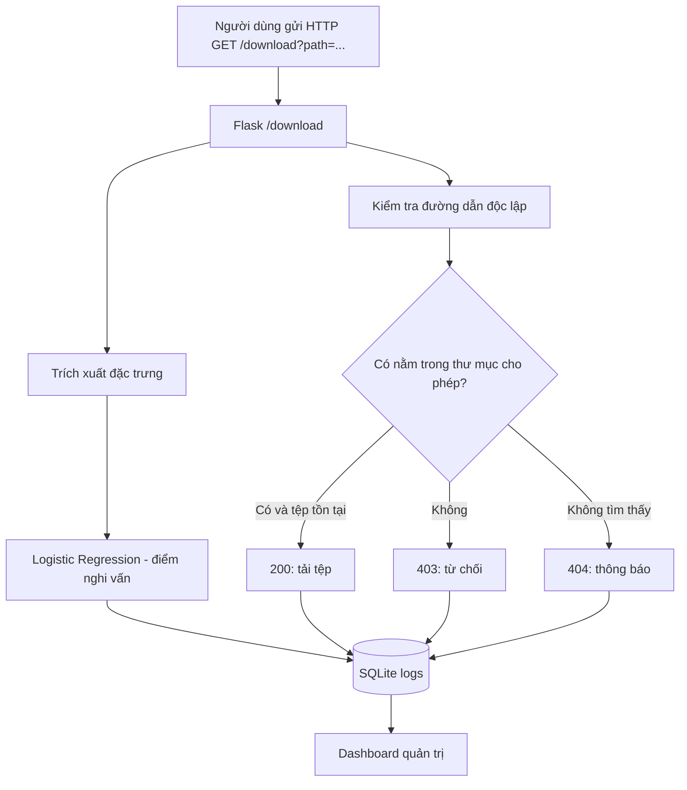

# Kiến trúc bản mẫu

```mermaid
flowchart TB
    U[Người dùng gửi HTTP GET /download?path=...] --> F[Flask /download]
    F --> FE[Trích xuất đặc trưng]
    FE --> LR[Logistic Regression - điểm nghi vấn]
    F --> SG[Kiểm tra đường dẫn độc lập]
    SG --> C{Có nằm trong thư mục cho phép?}
    C -->|Có và tệp tồn tại| A[200: tải tệp]
    C -->|Không| B[403: từ chối]
    C -->|Không tìm thấy| N[404: thông báo]
    LR --> L[(SQLite logs)]
    A --> L
    B --> L
    N --> L
    L --> D[Dashboard quản trị]
```

Điểm AI là tín hiệu giám sát, không nằm trên nhánh quyết định cấp quyền. Chương 3 nên vẽ thêm Sequence Diagram cho quy trình tải tệp và ERD bảng `access_logs`.
